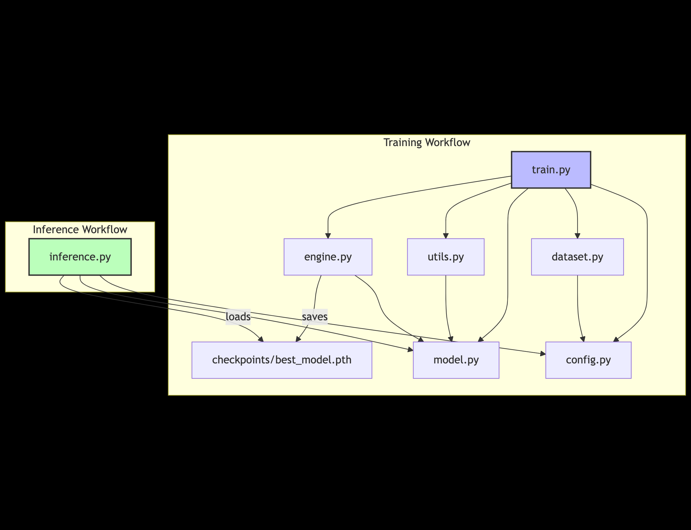

# MERS - Multimodal Emotion Recognition System
This project implements a deep learning model to recognize human emotions from video clips by analyzing **both visual (video frames) and auditory (speech)** information. The model uses a **ResNet-18** for image feature extraction and a pre-trained **Audio Spectrogram Transformer (AST)** for audio feature extraction, fusing them with a cross-attention mechanism to make a final prediction.

## Folder Structure
The project is organized into a modular structure to separate concerns and improve maintainability.

```
multimodal-emotion-recognition/
│
├── checkpoints/
│   └── best_model.pth          # Saved model weights after training
│
├── dataset/                    # (Not included) Placeholder for your dataset
│   └── cremad/
│       ├── cremad_paths.csv
│       └── ...
├── src/  
│   ├── config.py                   # All hyperparameters and configuration constants
│   ├── dataset.py                  # PyTorch Dataset for loading and preprocessing data
│   ├── engine.py                   # Core training and evaluation loops
│   ├── inference.py                # Script to run predictions on new videos
│   ├── model.py                    # Defines the neural network architecture
│   ├── train.py                    # Main script to start the training process
│   └── utils.py                    # Helper functions for fine-tuning and optimizer setup
├── README.md                   # This file
├── requirements.txt            # Project dependencies
```

## How the Modules Connect
The modules are designed to work together seamlessly. The train.py script acts as the main entry point, orchestrating the entire training process. It imports configurations from config.py, the data loader from dataset.py, the model architecture from model.py, helper functions from utils.py, and the training logic from engine.py.

The inference.py script is a standalone entry point that loads the trained model from the checkpoints directory and uses the same model.py and config.py modules to perform predictions on new data.

Here is a diagram illustrating the workflow:


## How to Run
### Setup

**Prerequisites:**

- Python 3.8+

- FFmpeg (must be installed and accessible from your system's PATH). This is required by the inference.py script to extract audio from video files.

**Installation:**

First, clone the repository and navigate into the project directory:

```
git clone <your-repo-url>
cd MERS
```

Next, create a virtual environment and install the required Python packages:

```
# Create and activate a virtual environment (recommended)
python -m venv venv
source venv/bin/activate  # On Windows, use `venv\Scripts\activate`
```

```
# Install dependencies
pip install -r requirements.txt
```

### Training

Before training, ensure your dataset is correctly placed and the `CSV_PATH` in `config.py` points to your data manifest file.

To start the training process, run the `train.py` script:

```
python train.py
```

The script will:

- Load the dataset and create data loaders.

- Initialize the model, optimizer, and loss function.

- Run the training loop for the number of epochs specified in config.py.

- Continuously evaluate the model on the validation set.

- Save the model checkpoint with the best validation accuracy to `checkpoints/best_model.pth.`

### Inference

Once the model is trained, you can use inference.py to predict the emotion from a single video file.
Run the script from your terminal, providing the path to your video file as an argument:

```
python inference.py /path/to/your/video.mp4
```

The script will output the predicted emotion and the model's confidence level. For example:

```
--- Inference Result ---
Predicted Emotion: HAP
Confidence: 50.00%
------------------------
```